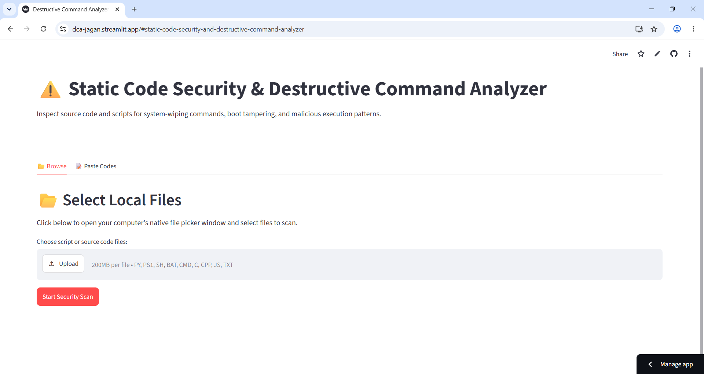
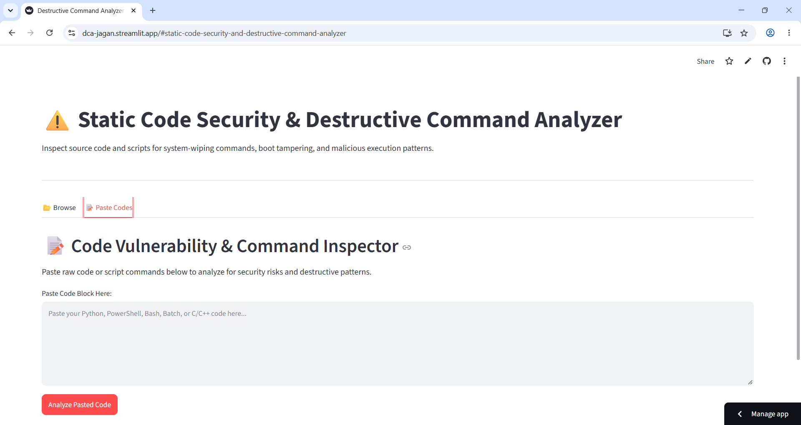
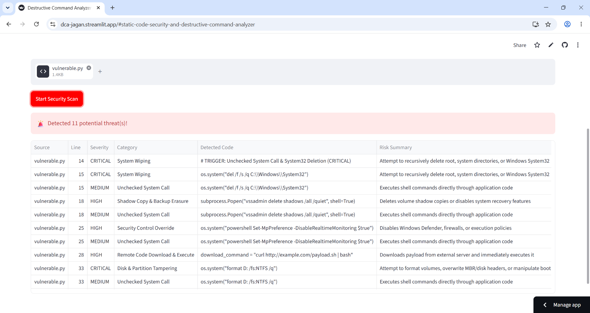
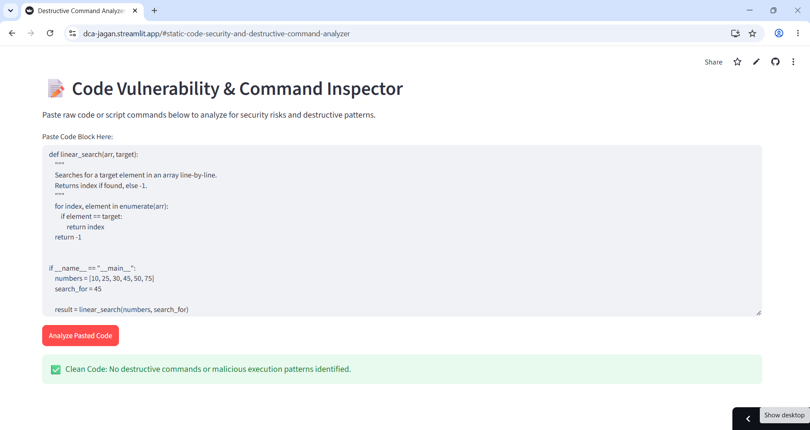

# Static Code Security & Destructive Command Analyzer

A Streamlit-based static analysis tool that scans source code and
scripts for potentially destructive commands, suspicious execution
patterns, and security-control tampering.

**Live application:** https://dca-jagan.streamlit.app

**GitHub repository:**
https://github.com/tech-man2007/Destructive-Command-Analyzer

> **Disclaimer:** This tool is intended for educational, defensive, and
> code-review purposes. It uses pattern matching to flag suspicious
> lines; findings are indicators for manual review, not proof that code
> is malicious or safe.

## Features

-   **Upload and scan files:** Select multiple supported source-code and
    script files from the *Browse* tab.
-   **Paste code for analysis:** Submit a code snippet directly through
    the *Paste Codes* tab.
-   **Rule-based detection:** Uses regular expressions to identify
    selected destructive commands and risky execution patterns.
-   **Severity labels:** Findings are categorized as `CRITICAL`, `HIGH`,
    or `MEDIUM`.
-   **Readable results:** Displays the source, line number, severity,
    category, detected line, and a short risk summary.
-   **Clean-scan feedback:** Reports when no configured patterns are
    detected.

## Screenshots

The screenshots below are stored in the repository's `screenshots/`
directory.

### 1. Browse and upload files



### 2. Paste code for analysis



### 3. Scan results and detected threats



### 4. Additional application view



## Detection Categories

  --------------------------------------------------------------------------------------
  Severity                Category                What the rule looks for
  ----------------------- ----------------------- --------------------------------------
  **CRITICAL**            System Wiping           Patterns associated with recursively
                                                  deleting root or system directories,
                                                  including Windows system paths.

  **CRITICAL**            Disk & Partition        Volume formatting, disk-header or
                          Tampering               boot-record manipulation, and
                                                  boot-configuration commands.

  **HIGH**                Shadow Copy & Backup    Commands associated with deleting
                          Erasure                 shadow copies or backup catalogs, or
                                                  altering partition settings.

  **HIGH**                Security Control        Attempts to change execution policies
                          Override                or disable real-time protection and
                                                  firewall controls.

  **HIGH**                Remote Code Download &  Download utilities piped directly into
                          Execute                 command interpreters or expression
                                                  evaluators.

  **HIGH**                Fork Bomb / Denial of   Selected patterns associated with fork
                          Service                 bombs or repeated process creation.

  **MEDIUM**              Unchecked System Call   Selected use of `os.system`,
                                                  `subprocess.Popen(..., shell=True)`,
                                                  `eval`, or `exec`.
  --------------------------------------------------------------------------------------

The rules are defined in `main.py`. They are intentionally pattern-based
and may produce false positives or miss obfuscated, indirect, or
otherwise unrecognized behavior.

## Supported File Types

The file uploader accepts:

-   Python (`.py`)
-   PowerShell (`.ps1`)
-   Shell scripts (`.sh`)
-   Windows batch and command files (`.bat`, `.cmd`)
-   C (`.c`)
-   C++ (`.cpp`)
-   JavaScript (`.js`)
-   Text (`.txt`)

Uploaded files are decoded as UTF-8, with undecodable bytes ignored.

## Run Locally

### Requirements

-   Python 3.9 or a compatible Python version supported by your
    installed Streamlit release
-   `pip`

### 1. Clone the repository

``` bash
git clone https://github.com/tech-man2007/Destructive-Command-Analyzer.git
cd Destructive-Command-Analyzer
```

### 2. (Optional) Create and activate a virtual environment

**Windows (PowerShell):**

``` powershell
python -m venv .venv
.venv\Scripts\Activate.ps1
```

**macOS / Linux:**

``` bash
python3 -m venv .venv
source .venv/bin/activate
```

### 3. Install dependencies

``` bash
pip install -r requirements.txt
```

The `requirements.txt` file contains:

``` text
streamlit
psutil
```

### 4. Start the application

``` bash
streamlit run main.py
```

Streamlit will print a local URL in the terminal, typically
`http://localhost:8501`. Open it in your browser.

## How to Use

1.  Open the [live application](https://dca-jagan.streamlit.app/) or run
    the app locally.
2.  Choose **Browse** to upload one or more supported files, or **Paste
    Codes** to enter a code snippet.
3.  Click **Start Security Scan** or **Analyze Pasted Code**, depending
    on the selected tab.
4.  Review any findings in the results table, including the line number,
    severity, category, and risk summary.
5.  Investigate each flagged line in context before deciding whether it
    represents a real issue.

## Project Structure

``` text
Destructive-Command-Analyzer/
├── .gitignore
├── main.py
├── README.md
├── requirements.txt
├── Detection/
│   └── vulnerable.py
├── No Detection/
│   └── safe.py
└── screenshots/
    ├── 1.png
    ├── 2.png
    ├── 3.png
    └── 4.png
```

-   `main.py` --- Streamlit application and rule-based code analyzer.
-   `requirements.txt` --- Python dependencies.
-   `Detection/vulnerable.py` --- Example file containing potentially
    dangerous patterns for testing detection.
-   `No Detection/safe.py` --- Example file intended to demonstrate code
    without the configured suspicious patterns.
-   `screenshots/` --- Application screenshots displayed in this README.
-   `.gitignore` --- Specifies files Git should ignore.

## Limitations

-   **Static pattern matching only:** The analyzer searches individual
    lines using predefined regular expressions. It does not execute
    code, build an abstract syntax tree, or perform full data-flow
    analysis.
-   **False positives and false negatives:** Benign code can match a
    rule, while obfuscated commands, multiline constructions, aliases,
    or patterns not covered by the rules may go undetected.
-   **Context matters:** A detected command is not automatically
    malicious. Review the surrounding code and intended behavior.
-   **Not a replacement for security tooling:** Use this as an
    additional review aid alongside code review, endpoint protection,
    sandboxing, and established security scanners.
-   **No guarantee of safety:** A clean result means only that the
    configured patterns were not found in the scanned text.

## Security and Privacy

Only upload or paste code that you are authorized to analyze. Treat
source code as potentially confidential and review the hosting
platform's data-handling policies before submitting sensitive material.
Do not use this tool as the sole basis for approving code for production
use.

## Contributing

Contributions and suggestions are welcome. To propose an improvement:

1.  Fork the repository.
2.  Create a branch for your change.
3.  Make and test your changes.
4.  Open a pull request describing the change and its purpose.

When adding detection rules, include a clear category, severity,
explanation, and test examples for both matching and non-matching input.
